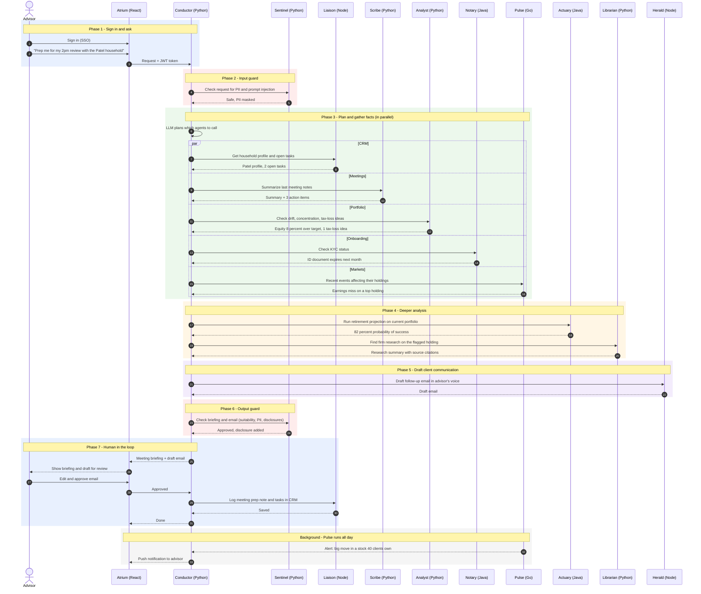
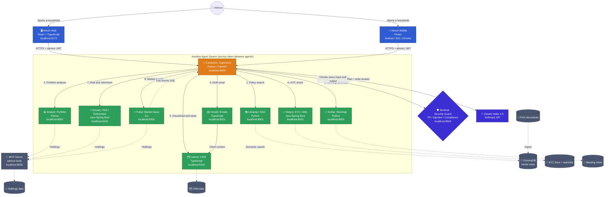

# Aurelius - Advisor Intelligence Swarm

A polyglot multi-agent system that helps wealth advisors spend less time on
admin and more time with clients.

## Port map
| Component            | Port |
|----------------------|------|
| Conductor (Python)   | 8000 |
| Python agents        | 8001-8004 |
| Node agents          | 8101-8102 |
| Java agents          | 8201-8202 |
| Go agent             | 8301 |
| MCP advisor-tools    | 8500 |
| ChromaDB             | 8600 |
| React console        | 5173 |

## Build steps
- [x] Step 01 - Folder structure
- [ ] Step 02 - Shared agent contract (JSON schema)
- [ ] Step 03 - Conductor orchestrator + LLM client
- [ ] Step 04 - RAG: ingestion + Librarian agent
- [ ] Step 05 - MCP server + Analyst agent
- [ ] Step 06 - Sentinel security agent
- [ ] Step 07 - Node agents
- [ ] Step 08 - Java agents
- [ ] Step 09 - Go agent
- [ ] Step 10 - React console
- [ ] Step 11 - docker-compose, end-to-end test

# 🏗️ Aurelius: System Architecture

